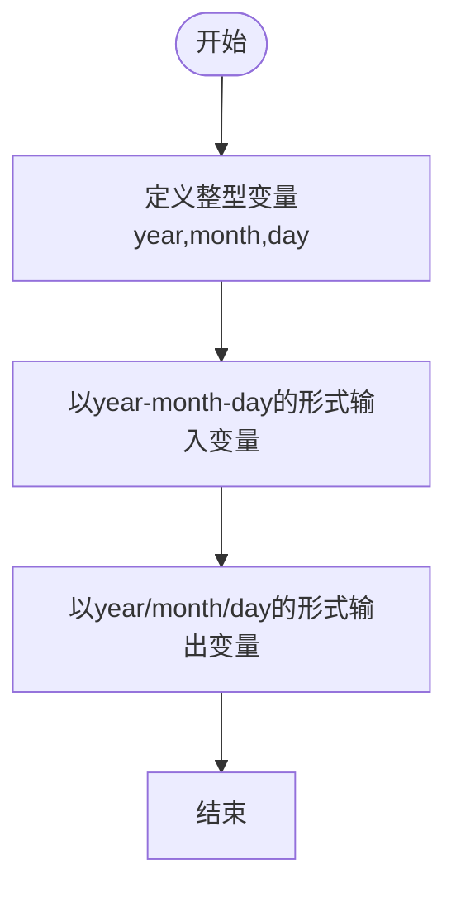
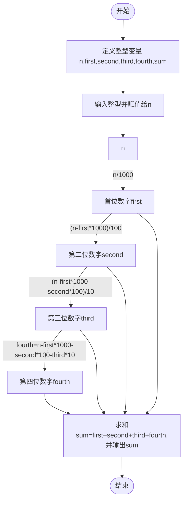

# 实验一 顺序结构程序设计

## 一、实验目的

1. 熟练掌握顺序结构程序设计；
2. 掌握标准输入输出函数的基本用法；
3. 熟练掌握基本运算符与基本数据类型；
4. 练习调试与修改程序。

## 二、实验环境

操作系统：Windows

开发工具：CodeBlocks

## 三、实验内容

#### 【题目 1】从键盘输入一个 10 进制数，输出该数的 16 进制数。 比如（黄底黑字为用户输入内容）：

#### Input:==$\textcolor{red}{255}$==

#### 0xFF

#### 又比如（黄底黑字为用户输入内容）：、

#### Input：==$\textcolor{red}{20}$==

#### 0x14


#### 【题目 2】从键盘输入一个小写英文字母，首先输出它及其 ASCII 码，然后输出其对应的 大写字母及其 ASCII 码。 比如（黄底黑字为用户输入内容）：

#### Input: ==$\textcolor{red}{y}$==

#### ASCII: 121 

#### Upper: Y 

#### ASCII: 89


#### 【题目 3】从键盘输入一个日期，年月日之间以“-”分隔。以“/”作分隔符将该日期输 出。 

#### 比如（黄底红字为用户输入内容）： 

#### Input a date: ==$\textcolor{red}{2019-09-25}$==

#### 2019/09/25


#### 【题目 4】从键盘输入一个天数，将其转换成周数和天数并输出。 

#### 比如（黄底红字为用户输入内容）： 

#### Input a number of days: ==$\textcolor{red}{18}$== 

#### 18 days are 2 weeks and 4 days. 

#### 又比如（黄底红字为用户输入内容）：

####  Input a number of days: ==$\textcolor{red}{5}$==

####  5 days are 0 weeks and 5 days.


#### 【题目 5】从键盘输入一个四位整数，计算各个位上的数字之和。 比如（黄底红字为用户输入内容）： 

#### Input a number with 4-digit: ==$\textcolor{red}{1234} $==

#### 10

## 四、实验过程

#### 4.1  题目 1

根据题目要求,编写程序如下所示：

```c
#include <stdio.h>
#include <stdlib.h>

int main()
{
    int n;
    printf("Input:");
    scanf("%d",&n);
    printf("0x%X",n);
    return 0;
}
```


程序运行结果如图 1 所示：


<center>图1</center>


#### 4.2 题目2

根据题目要求,编写程序如下所示：

```c
#include <stdio.h>
#include <stdlib.h>

int main()
{
    char n;
    printf("Input:");
    scanf("%s",&n);
    printf("ASCII:%d\nUpper:%c\nASCII:%d",n,n-32,n-32);
    return 0;
}
```


程序运行结果如图 2 所示：


<center>图2</center>


#### 4.3 题目3

首先，确定程序流程图，如图3所示：



<center>图3</center>


根据题目要求，编写程序如下所示：

```c
#include <stdio.h>
#include <stdlib.h>

int main()
{
    int year,month,day;
    printf("Input a date:");
    scanf("%d-%d-%d",&year,&month,&day);
    printf("%d/%d/%d",year,month,day);
    return 0;
}
```


程序运行结果如图4所示：


<center>图4</center>


#### 4.4 题目4

根据题目要求,编写程序如下所示：

```c
#include <stdio.h>
#include <stdlib.h>

int main()
{
    printf("Input a number of days:");
    int n,weeks,days;
    scanf("%d",&n);
    weeks=n/7;
    days=n-weeks*7;
    printf("%d days are %d weeks and %d days",n,weeks,days);
    return 0;
}
```


程序运行结果如图5所示：


<center>图5</center>


#### 4.5 题目5

首先，确定程序流程图，如图6所示。



<center>图6</center>


根据题目要求，编写程序如下所示：

```c
#include <stdio.h>
#include <stdlib.h>

int main()
{
    int n,first,second,third,fourth,sum;
    printf("Input a number with 4-digit:");
    scanf("%d",&n);
    first=n/1000;
    second=(n-first*1000)/100;
    third=(n-first*1000-second*100)/10;
    fourth=n-first*1000-second*100-third*10;
    sum=first+second+third+fourth;
    printf("%d",sum);
    return 0;
}
```


程序运行结果如图7所示：


<center>图7</center>


## 五、实验心得体会

#### 5.1 实验收获

1. 掌握了C语言的基础写法
2. 学会了设计顺序结构程序
3. 学会了通过Markdown编写实验文档

#### 5.2 遇到的问题

1. 实验报告排版较乱，需要花费较多时间进行反复调整
2. 对CodeBlocks的开发环境不是很熟悉
3. 不熟悉制作流程图
